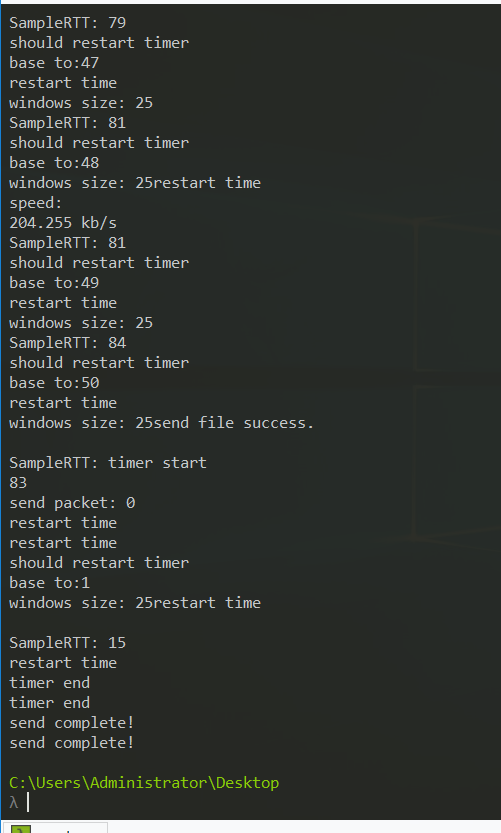
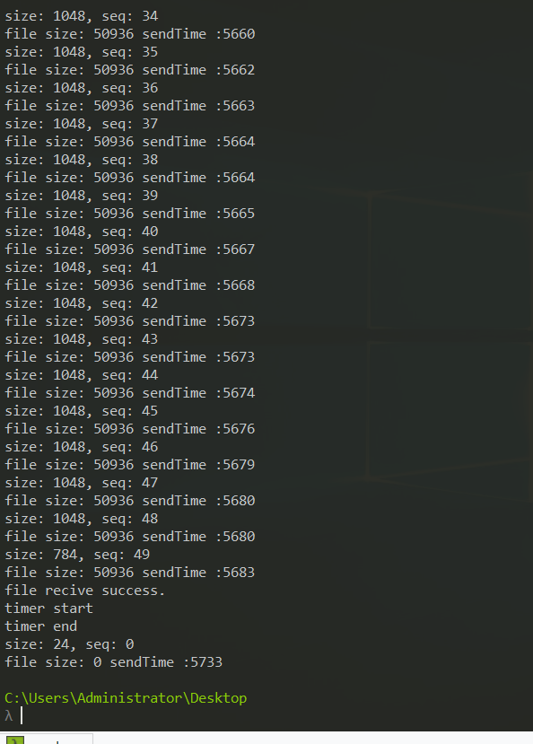
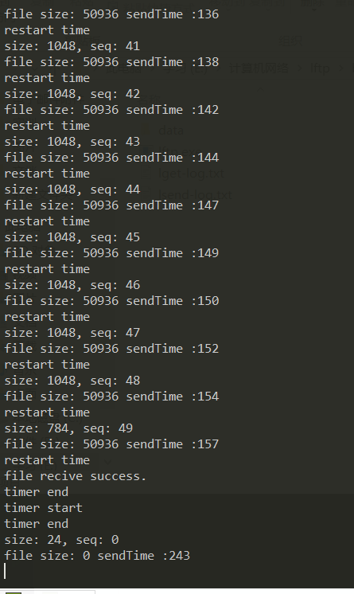
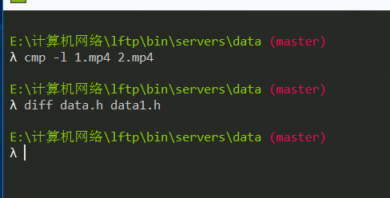
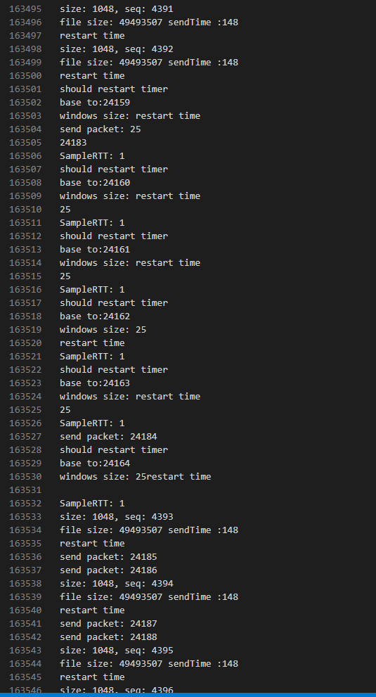

# LFTP (C++) 测试文档
1. 在根目录下编译服务器:
   ```sh
   g++ lib\reciver.cpp lib\sender.cpp servers\servers.cpp -I include -lwsock32 -Wall -std=c++11 -o servers
   ```
   编译客户端:
   ```sh
   g++ lib\reciver.cpp lib\sender.cpp client\client.cpp -I include -lwsock32 -Wall -std=c++11 -o lftp
   ```
2. 远程传输文件测试
    * 首先是小文件：data.h
        * 客户端
  
            | lsend | lget |
            | :------: | :-------: |
            |  |  |
        * 服务器端：

            
    * 大文件日志太长，日志信息保存在logs文件夹中。
        * 大文件传输成功保证，使用`cmp -l`比较二进制文件, `diff`的两个比较小的用来测试文本文件的。
  
            
    * 多客户端日志在`servers logs`下
        ```sh
        file size: **** sendTime: **** 是服务器作为接收方的日志信息。
        SampleRTT: * base to : ***** 是服务器作为发送方的日志信息。
        ```
        